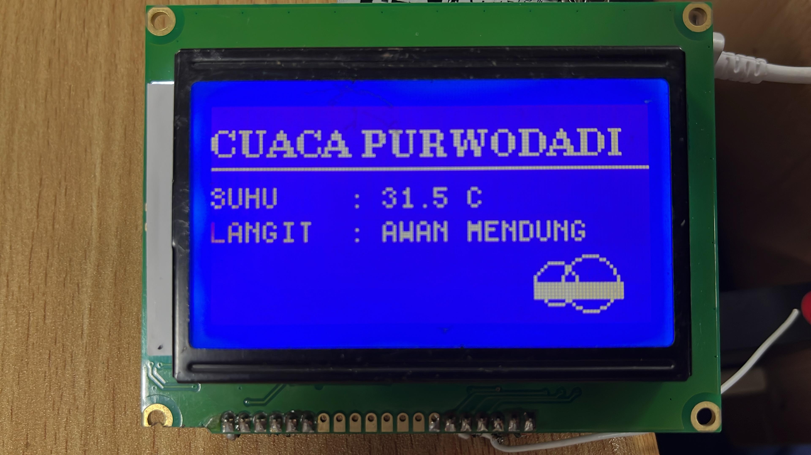
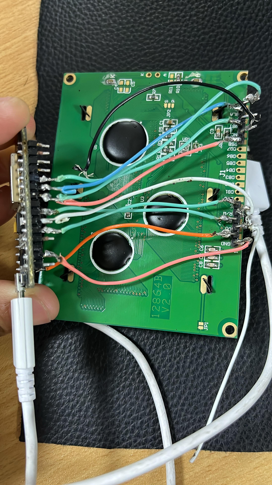

# Proyek Cuaca dari API

Ini adalah program untuk mengambil data cuaca dari API kemudian menampilkan pada LCD 128x64 dengan ESP8266.

## Hasil LCD

## Deskripsi
Aplikasi ini akan menampilkan cuaca terkini berdasarkan lokasi yang dimasukkan.

PIN yang digunakan pada esp 8266 dan LCD12864

*BLK-GND
*BLA-3V
*RST-D4
*PSB-GND

*E-D8
*R/W-D7
*RS-D6
*VCC-5V
*GND-GND
## Pin yang digunakan

